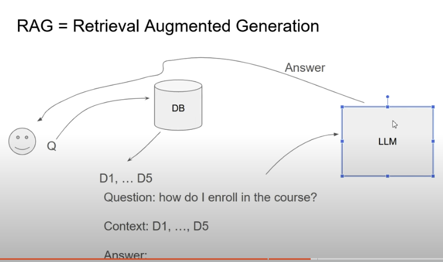
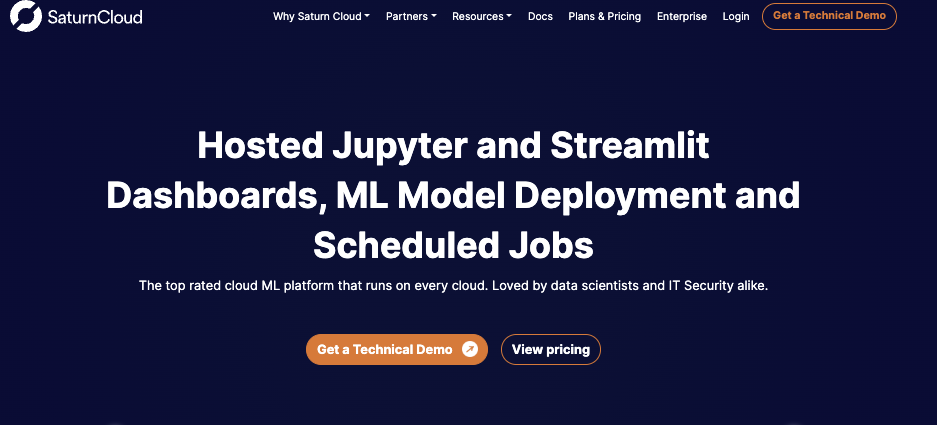
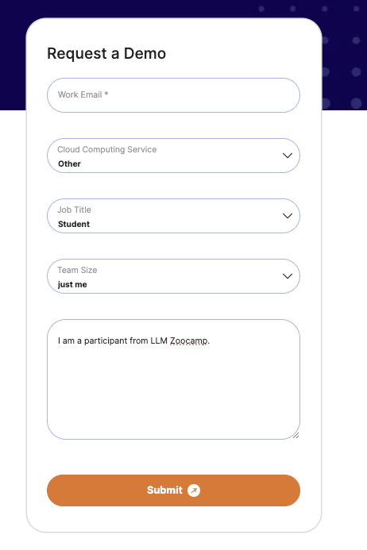

# Week 2 notes

### Table of contents

- [2.1 Open-Source LLMs - Introduction](#21-open-source-llms---introduction)
    - [Open-Source LLMs](#open-source-llms)
    - [Replacing the LLM box in the RAG flow](#replacing-the-llm-box-in-the-rag-flow)
- [2.2 Using a GPU in Saturn Cloud](#22-using-a-gpu-in-saturn-cloud)
    - [Registering in Saturn Cloud](#registering-in-saturn-cloud)
    - [Configuring Secrets and Git](#configuring-secrets-and-git)
    - [Creating an instance with GPU](#creating-an-instance-with-gpu)

## 2.1 Open-Source LLMs - Introduction

In this week's lecture, we will be exploring alternatives to `OPENAI`, and in particular, we will be discussing more on **Open-Sourced LLMs** and how to run them. There are several ways to run open-source LLM models, depending on your technical expertise and available resources. Here are some options:

1. Local Machine:
- If you have a powerful computer with a good GPU, you can run models using libraries like Hugging Face's `Transformers` or `LlamaIndex`.
- This requires some technical knowledge and setup.

2. Cloud Services:
- Google Colab: Free option with GPU access, good for experimenting.
- AWS SageMaker, Google Cloud AI Platform, or Azure Machine Learning: For more robust, scalable solutions.

3. Specialized Platforms:
- `Hugging Face`: Offers a platform to run many open-source models.
- `Replicate`: Allows running various AI models in the cloud.

4. Self-hosted Solutions:
- Set up your own server or use a service like `Paperspace` or `Lambda Labs`.

5. Containerized Deployments:
- Use `Docker` to package and deploy models on various platforms.

6. Specialized Hardware:
- `Raspberry Pi` or other single-board computers for smaller models.

7. Open-source Frameworks:
- `Ollama`: Allows running LLMs locally with a simple interface.
- `LocalAI`: For running AI models on consumer-grade hardware.

8. Community-driven Platforms:
- `EleutherAI`: Offers access to some of their models.

Remember, running large models requires significant computational resources. Smaller models or quantized versions might be more suitable for personal use.

### Open-Source LLMs

There are many open-source LLM models available. Here's a list of some popular ones:

1. BERT (Bidirectional Encoder Representations from Transformers)
- Developed by Google
- Good for understanding context in language

2. GPT-2 (Generative Pre-trained Transformer 2)
- Created by OpenAI
- Smaller version of GPT-3, good for text generation

3. T5 (Text-to-Text Transfer Transformer)
- Developed by Google
- Versatile model for various NLP tasks

4. BLOOM (BigScience Large Open-science Open-access Multilingual Language Model)
- Created by BigScience
- Large multilingual model

5. LLaMA (Large Language Model Meta AI)
- Developed by Meta (Facebook)
- Range of sizes, from 7B to 65B parameters

6. Falcon
- Created by Technology Innovation Institute (TII)
- Known for efficiency and performance

7. RWKV
- An alternative architecture to Transformer models
- Good for both small and large-scale deployments

8. GPT-J and GPT-NeoX
- Developed by EleutherAI
- Open-source alternatives to GPT-3

9. OPT (Open Pre-trained Transformer)
- Released by Meta
- Designed to be more accessible for research

10. FLAN-T5
- Google's instruction-tuned version of T5

11. Pythia
- A suite of models from EleutherAI for studying AI behavior

13. Dolly
- Databricks' instruction-following model

These are to name a few and we should be having a feel of few of them in subsequent lectures. And what we are going to cover is how to run these models, which normally requires a lot of GPU. And we are going to need a proper environment for doing so. This too will be discussed as we progress into the course.

### Replacing the LLM box in the RAG flow

So what we are going to do is to replace the LLM "BOX" as seen below with some other open-sourced LLM. This would be the focus of this module.

In particular, we will see how to set up an environment and use different LLMs, as well as accessing these models using `HuggingFace`.

## 2.2 Using a GPU in Saturn Cloud

In this section we are going to learn more about `SaturnCloud` and how to set up a GPU-enabled notebook as they are required for most open-sourced LLMs, and `SaturnCloud` provides the enviroment for doing so. There are of course alternatives like `GoogleColab` and `AWS SageMaker`, but feel free to use what works best for you.
 
### Registering in Saturn Cloud

Go to [SaturnCloud's](https://saturncloud.io/) website and click on `Get a Techinical Demo`

Next, in the landing page, input the details as follows - use your own personal email of course.

### Configuring Secrets and Git

### Creating an instance with GPU